# Welcome to the GRACE & GLDAS Tools

The ggtools package is an archive of scientific routines that can be used to
handle the GRACE(Gravity Recovery and Climate Experiment) and GRACE-FO(Follow-on) GSM data(RL06 Level-2 monthly solutions) and GLDAS grid data.

## Table of Contents

[toc]

## How to Install 

GGTOOLS can be installed with the following two steps

1. `conda install cartopy h5py`
2. `pip install ggtools`

## How to use

## GRACE

### Download static gravity models

Download static gravity models GGM05C and EIGEN-6C4 from [ICGEM](http://icgem.gfz-potsdam.de/home)(International Centre for Global Earth Models). This is not a necessary step unless you want to prepare for removing the background(reference) gravity field from the GRACE GSM data later.


```python
from ggtools.gg import static_download
for static_model in ['GGM05C','EIGEN-6C4']:
    gravity_model = static_download(static_model)
    print(gravity_model)
```

    static_models/GGM05C.gfc
    static_models/EIGEN-6C4.gfc


For more details, please refer to `static_download?`.

### Check the time coverage of the GRACE GSM data

GRACE GSM data is expressed as a form of Spherical Harmonic Coefficients(SHCs) or Stokes coefficients. Before downloading the GRACE GSM data from [ISDC](https://isdc.gfz-potsdam.de/grace-isdc/)(Information System and Data Center), it's suggested to view the time intervals for all feasible GRACE GSM data so far published by CSR(University of Texas Center for Space Research), GFZ(German Research Centre for Geosciences), and JPL(Jet Propulsion Laboratory). This is not a necessary step, but it can help to understand the outline of the data.


```python
from ggtools.gg import print_gsm_date_coverage
for source in ['CSR','GFZ','JPL']:
    print_gsm_date_coverage(source,96)
    print_gsm_date_coverage(source,60)
```

    GSM data for CSR_RL06_96 is available from 2002-04-05 to 2019-10-31
    GSM data for CSR_RL06_60 is available from 2002-04-05 to 2019-10-31
    GSM data for GFZ_RL06_96 is available from 2002-04-05 to 2019-10-31
    GSM data for GFZ_RL06_60 is available from 2002-04-05 to 2019-10-31
    GSM data for JPL_RL06_96 is available from 2002-04-04 to 2019-10-31
    GSM data for JPL_RL06_60 is available from 2002-04-04 to 2019-10-31


For more details, please refer to `print_gsm_date_coverage?`.

### Download GRACE GSM data

Download all feasible GRACE GSM data published by CSR, GFZ, and JPL so far.


```python
from ggtools.gg import gsm_download
for source in ['CSR','GFZ','JPL']:
    gsm_download(source,96) 
    gsm_download(source,60)
```

```Downloading ...  GSM-2_2019274-2019304_GRFO_UTCSR_BB01_0600.gz ... 226 Transfer complete
Downloading ...  GSM-2_2019274-2019304_GRFO_UTCSR_BB01_0600.gz ... 226 Transfer complete
Downloading ...  GSM-2_2019274-2019304_GRFO_UTCSR_BA01_0600.gz ... 226 Transfer complete
Downloading ...  GSM-2_2019274-2019304_GRFO_JPLEM_BB01_0600.gz ... 226 Transfer complete
Downloading ...  GSM-2_2019274-2019304_GRFO_JPLEM_BA01_0600.gz ... 226 Transfer complete
```

For more details, please refer to `gsm_download?`.

### Download  SLR C20 data

Download SLR C20 data(RL06 monthly solutions) published by CSR.


```python
from ggtools.gg import slr_c20_download
slr_c20_download()
```

    Downloading ...  TN-11_C20_SLR_RL06.txt ... 226 Transfer complete


For more details, please refer to `slr_c20_download?`.

### Read GRACE GSM data

Read all 96th-degree GRACE GSM data downloaded previously.


```python
from ggtools.gg import read_gsm
csr_gsm = read_gsm('CSR',96)
gfz_gsm = read_gsm('GFZ',96)
jpl_gsm = read_gsm('JPL',96)

# basic information on GRACE GSM data
print(csr_gsm,'\n')
print(gfz_gsm,'\n')
print(jpl_gsm)
```

    title = GRACE & GRACE-FO Geopotential Coefficients CSR RL06
    max_degree = 96
    max_order = 96
    degree_order = 96
    normalization = fully normalized
    institution = UT-AUSTIN/CSR
    processing_level = 2
    product_version = RL06
    time_coverage_start = 2002-04
    time_coverage_end = 2019-10
    solution_counts = 178
    total_month_counts = 211
    missing_month_counts = 33 
    
    title = GRACE & GRACE-FO Geopotential GSM Coefficients GFZ RL06
    max_degree = 96
    max_order = 96
    degree_order = 96
    normalization = fully normalized
    institution = GFZ German Research Centre for Geosciences
    processing_level = 2
    product_version = 6.0
    time_coverage_start = 2002-04
    time_coverage_end = 2019-10
    solution_counts = 178
    total_month_counts = 211
    missing_month_counts = 33 
    
    title = GRACE & GRACE-FO Geopotential Coefficients JPL RL06
    max_degree = 96
    max_order = 96
    degree_order = 96
    normalization = fully normalized
    institution = NASA/JPL
    processing_level = 2
    product_version = 6.0
    time_coverage_start = 2002-04
    time_coverage_end = 2019-10
    solution_counts = 169
    total_month_counts = 211
    missing_month_counts = 42


For more details, please refer to `read_gsm?` and `csr_gsm?`.


```python
print(csr_gsm.summary)
print(csr_gsm.background_gravity)
print(csr_gsm.earth_gravity_param)
print(csr_gsm.permanent_tide)
print(csr_gsm.mean_equator_radius)
print(csr_gsm.missing_month,'\n')

print(gfz_gsm.background_gravity)
print(gfz_gsm.permanent_tide)
print(gfz_gsm.mean_equator_radius,'\n')

print(jpl_gsm.missing_month)
print(jpl_gsm.shc[10],'\n') # geopotential coefficients for the 10th monthly solution
print(jpl_gsm.shc_std[10]) # standard deviation in geopotential coefficients
```

    Spherical harmonic coefficients representing an estimate of the mean gravity field of Earth during the specified timespan derived from GRACE & GRACE-FO mission measurements. These coefficients represent the full magnitude of land hydrology, ice, and solid Earth processes. Further, they represent atmospheric and oceanic processes not captured in the accompanying GAC product. The 0th and 1st degree terms are excluded from CSR level-2.
    GGM05C
    3.9860044150E+14 m3/s2
    inclusive
    6.3781363000E+06 m
    ['2002-06' '2002-07' '2003-06' '2011-01' '2011-06' '2012-05' '2012-10'
     '2013-03' '2013-08' '2013-09' '2014-02' '2014-07' '2014-12' '2015-07'
     '2015-10' '2015-11' '2016-04' '2016-09' '2016-10' '2017-02' '2017-07'
     '2017-08' '2017-09' '2017-10' '2017-11' '2017-12' '2018-01' '2018-02'
     '2018-03' '2018-04' '2018-05' '2018-08' '2018-09'] 
     
    EIGEN-6C4
    exclusive
    6.3781364600E+06 m 
    
    ['2002-06' '2002-07' '2003-06' '2004-07' '2004-08' '2004-09' '2004-10'
     '2011-01' '2011-06' '2012-04' '2012-05' '2012-06' '2012-07' '2012-10'
     '2013-03' '2013-08' '2013-09' '2014-02' '2014-07' '2014-12' '2015-01'
     '2015-02' '2015-07' '2015-10' '2015-11' '2016-04' '2016-09' '2016-10'
     '2017-02' '2017-07' '2017-08' '2017-09' '2017-10' '2017-11' '2017-12'
     '2018-01' '2018-02' '2018-03' '2018-04' '2018-05' '2018-08' '2018-09']
    [[[ 1.00000000e+00  0.00000000e+00  0.00000000e+00 ...  0.00000000e+00
        0.00000000e+00  0.00000000e+00]
      [ 0.00000000e+00  0.00000000e+00  0.00000000e+00 ...  0.00000000e+00
        0.00000000e+00  0.00000000e+00]
      [-4.84169287e-04 -2.29490037e-10  2.43933401e-06 ...  0.00000000e+00
        0.00000000e+00  0.00000000e+00]
      ...
      [ 9.37921024e-11 -8.38607258e-11 -2.33486569e-10 ... -2.26383594e-09
        0.00000000e+00  0.00000000e+00]
      [ 5.33299728e-10  1.81153117e-09  2.78305221e-10 ...  2.61977837e-09
        2.59548687e-09  0.00000000e+00]
      [-1.25276141e-09  5.11732945e-10  1.26614370e-09 ...  1.14454762e-09
        1.62194507e-09 -2.14363128e-09]]
    
     [[ 0.00000000e+00  0.00000000e+00  0.00000000e+00 ...  0.00000000e+00
        0.00000000e+00  0.00000000e+00]
      [ 0.00000000e+00  0.00000000e+00  0.00000000e+00 ...  0.00000000e+00
        0.00000000e+00  0.00000000e+00]
      [ 0.00000000e+00  1.38511555e-09 -1.40030144e-06 ...  0.00000000e+00
        0.00000000e+00  0.00000000e+00]
      ...
      [ 0.00000000e+00  2.29543385e-09  1.35606111e-10 ... -1.57903333e-09
        0.00000000e+00  0.00000000e+00]
      [ 0.00000000e+00  6.34755345e-10 -2.53978387e-10 ... -1.20141984e-09
       -3.45902449e-10  0.00000000e+00]
      [ 0.00000000e+00  1.63243506e-09 -7.04276590e-11 ... -2.73715185e-09
        4.34383583e-10  1.63871799e-09]]]
        
    [[[0.0000e+00 0.0000e+00 0.0000e+00 ... 0.0000e+00 0.0000e+00 0.0000e+00]
      [0.0000e+00 0.0000e+00 0.0000e+00 ... 0.0000e+00 0.0000e+00 0.0000e+00]
      [6.4545e-12 3.4606e-12 1.3888e-12 ... 0.0000e+00 0.0000e+00 0.0000e+00]
      ...
      [1.5314e-11 1.5326e-11 1.5305e-11 ... 4.5916e-11 0.0000e+00 0.0000e+00]
      [1.4790e-11 1.4741e-11 1.4724e-11 ... 4.1441e-11 4.6175e-11 0.0000e+00]
      [1.5805e-11 1.5750e-11 1.5728e-11 ... 1.1087e-10 3.9720e-11 4.0593e-11]]
    
     [[0.0000e+00 0.0000e+00 0.0000e+00 ... 0.0000e+00 0.0000e+00 0.0000e+00]
      [0.0000e+00 0.0000e+00 0.0000e+00 ... 0.0000e+00 0.0000e+00 0.0000e+00]
      [0.0000e+00 3.0349e-12 1.4492e-12 ... 0.0000e+00 0.0000e+00 0.0000e+00]
      ...
      [0.0000e+00 1.5277e-11 1.5313e-11 ... 4.5258e-11 0.0000e+00 0.0000e+00]
      [0.0000e+00 1.4695e-11 1.4742e-11 ... 4.1784e-11 4.6037e-11 0.0000e+00]
      [0.0000e+00 1.5703e-11 1.5747e-11 ... 1.1097e-10 3.9901e-11 4.0941e-11]]]


Note that CSR and GFZ use different background(reference) gravity models. One is GGM05C and the other is EIGEN-6C4. These two gravity models define the same Earth gravity constant, but slightly different Earth's mean equator radius. In addition, both GGM05C and the monthly solutions released by CSR include the permanent tide. In contrast, neither EIGEN-6C4 nor the monthly solutions released by GFZ  include this item. Therefore, it is necessary to remove the background field or the average field from the monthly solutions.

### De-average GRACE GSM data

Remove the average field from the monthly solutions.


```python
csr_gsm_deaverage = csr_gsm.deaverage()
gfz_gsm_deaverage = gfz_gsm.deaverage()
jpl_gsm_deaverage = jpl_gsm.deaverage()

print(csr_gsm_deaverage,'\n')
print(csr_gsm_deaverage.background_gravity,'\n')
print(csr_gsm_deaverage.shc[10],'\n')
print(csr_gsm_deaverage.shc_std[10])
```

    title = Deaveraged GRACE & GRACE-FO Geopotential Coefficients CSR RL06
    max_degree = 96
    max_order = 96
    degree_order = 96
    normalization = fully normalized
    institution = UT-AUSTIN/CSR
    processing_level = 2
    product_version = RL06
    time_coverage_start = 2002-04
    time_coverage_end = 2019-10
    solution_counts = 178
    total_month_counts = 211
    missing_month_counts = 33
    
    Average of monthly solutions
    
    [[[ 0.00000000e+00  0.00000000e+00  0.00000000e+00 ...  0.00000000e+00
        0.00000000e+00  0.00000000e+00]
      [ 0.00000000e+00  0.00000000e+00  0.00000000e+00 ...  0.00000000e+00
        0.00000000e+00  0.00000000e+00]
      [ 1.84422663e-10  9.25679556e-11 -3.83500305e-11 ...  0.00000000e+00
        0.00000000e+00  0.00000000e+00]
      ...
      [ 6.10660859e-12  2.02340281e-13  7.35534442e-12 ...  4.30518176e-11
        0.00000000e+00  0.00000000e+00]
      [-3.59387039e-12 -6.02718201e-12 -1.68845289e-12 ... -2.47010217e-11
        9.95521155e-13  0.00000000e+00]
      [-2.09598368e-12  4.38205266e-12 -3.08504132e-12 ... -1.06180191e-10
       -4.22540682e-12  9.45004334e-12]]
    
     [[ 0.00000000e+00  0.00000000e+00  0.00000000e+00 ...  0.00000000e+00
        0.00000000e+00  0.00000000e+00]
      [ 0.00000000e+00  0.00000000e+00  0.00000000e+00 ...  0.00000000e+00
        0.00000000e+00  0.00000000e+00]
      [ 0.00000000e+00 -6.95504729e-11  4.66008820e-12 ...  0.00000000e+00
        0.00000000e+00  0.00000000e+00]
      ...
      [ 0.00000000e+00 -2.02779108e-12  1.28132376e-12 ...  2.70660778e-11
        0.00000000e+00  0.00000000e+00]
      [ 0.00000000e+00  6.34766059e-12 -1.40266107e-12 ... -1.63210355e-11
        1.74411386e-12  0.00000000e+00]
      [ 0.00000000e+00 -2.98368541e-12 -1.09980733e-11 ... -7.87717175e-11
       -7.85024577e-12 -4.73324005e-12]]]
       
    [[[0.000e+00 0.000e+00 0.000e+00 ... 0.000e+00 0.000e+00 0.000e+00]
      [0.000e+00 0.000e+00 0.000e+00 ... 0.000e+00 0.000e+00 0.000e+00]
      [3.374e-13 5.154e-13 6.335e-13 ... 0.000e+00 0.000e+00 0.000e+00]
      ...
      [1.033e-11 1.034e-11 1.032e-11 ... 1.717e-11 0.000e+00 0.000e+00]
      [9.930e-12 9.886e-12 9.858e-12 ... 6.068e-12 5.054e-12 0.000e+00]
      [1.056e-11 1.054e-11 1.053e-11 ... 4.096e-11 6.989e-12 7.420e-12]]
    
     [[0.000e+00 0.000e+00 0.000e+00 ... 0.000e+00 0.000e+00 0.000e+00]
      [0.000e+00 0.000e+00 0.000e+00 ... 0.000e+00 0.000e+00 0.000e+00]
      [0.000e+00 4.225e-13 7.317e-13 ... 0.000e+00 0.000e+00 0.000e+00]
      ...
      [0.000e+00 1.028e-11 1.035e-11 ... 1.713e-11 0.000e+00 0.000e+00]
      [0.000e+00 9.790e-12 9.923e-12 ... 6.232e-12 5.132e-12 0.000e+00]
      [0.000e+00 1.047e-11 1.060e-11 ... 4.089e-11 6.981e-12 7.459e-12]]]


For more details, please refer to `csr_gsm.deaverage?`.

### De-background  GRACE GSM data

Remove the background field from the monthly solutions. This step is not necessary, but it can be used as a way to verify the de-averaged monthly solutions.


```python
csr_gsm_debackground = csr_gsm.debackground()

print(csr_gsm_debackground,'\n')
print(csr_gsm_debackground.background_gravity,'\n')
print(csr_gsm_debackground.shc[10])
```

    title = Debackgrounded GRACE & GRACE-FO Geopotential Coefficients CSR RL06
    max_degree = 96
    max_order = 96
    degree_order = 96
    normalization = fully normalized
    institution = UT-AUSTIN/CSR
    processing_level = 2
    product_version = RL06
    time_coverage_start = 2002-04
    time_coverage_end = 2019-10
    solution_counts = 178
    total_month_counts = 211
    missing_month_counts = 33
    
    GGM05C
    
    [[[ 0.00000000e+00  0.00000000e+00  0.00000000e+00 ...  0.00000000e+00
        0.00000000e+00  0.00000000e+00]
      [ 0.00000000e+00  0.00000000e+00  0.00000000e+00 ...  0.00000000e+00
        0.00000000e+00  0.00000000e+00]
      [ 1.74518000e-10  5.89105312e-11 -3.82188300e-11 ...  0.00000000e+00
        0.00000000e+00  0.00000000e+00]
      ...
      [ 6.74305609e-12  1.42961946e-12  6.05156366e-12 ...  3.27285439e-11
        0.00000000e+00  0.00000000e+00]
      [-8.92741659e-12 -6.19449953e-12 -2.38098621e-12 ... -1.06105863e-10
       -6.68478535e-12  0.00000000e+00]
      [-7.51046521e-13  6.47684322e-12 -1.89032517e-13 ... -1.01848744e-10
        5.33312012e-11 -6.95728099e-12]]
    
     [[ 0.00000000e+00  0.00000000e+00  0.00000000e+00 ...  0.00000000e+00
        0.00000000e+00  0.00000000e+00]
      [ 0.00000000e+00  0.00000000e+00  0.00000000e+00 ...  0.00000000e+00
        0.00000000e+00  0.00000000e+00]
      [ 0.00000000e+00 -2.56846039e-11 -1.36937040e-11 ...  0.00000000e+00
        0.00000000e+00  0.00000000e+00]
      ...
      [ 0.00000000e+00 -1.45661890e-12 -1.10232503e-13 ...  1.36114572e-11
        0.00000000e+00  0.00000000e+00]
      [ 0.00000000e+00  8.23449794e-12 -5.41604372e-13 ... -1.59533178e-10
       -6.78363971e-12  0.00000000e+00]
      [ 0.00000000e+00 -4.55778346e-12 -9.57638370e-12 ... -6.04274164e-11
       -2.73714269e-11 -5.54947649e-12]]]


For more details, please refer to `csr_gsm.debackground?`.

### Read SLR C20 data

Read all feasible SLR C20 RL06 monthly solutions so far.


```python
from ggtools.gg import read_slr_c20
slr_c20 = read_slr_c20()
print(slr_c20)
```

    title = Monthly estimates of C20 from 5 SLR satellites based on GRACE RL06 models.
    normalization = fully normalized
    institution = Center for Space Research, The University of Texas at Austin
    product_version = RL06
    time_coverage_start = 2002-04
    time_coverage_end = 2019-10
    solution_counts = 178
    total_month_counts = 211
    missing_month_counts = 33


For more details, please refer to `read_slr_c20?` and `slr_c20?`.


```python
print(slr_c20.summary,'\n')
print(slr_c20.missing_month,'\n')
print(slr_c20.date_issued,'\n')
print(slr_c20.background_gravity)

print(slr_c20.mean_c20,'\n') # c20 in GGM05C
print(slr_c20.c20,'\n')
print(slr_c20.c20_std,'\n')
print(slr_c20.c20_demean) # c20 - c20 in GGM05C
```

    As a convenience to users who wish to use a replacement value for C20, a monthly C20 estimate time series is provided. These estimates are obtained from the analysis of Satellite Laser Ranging (SLR) data to five geodetic satellites: LAGEOS-1 and 2, Starlette, Stella and Ajisai. The background gravity satellites model used in the SLR analysis is consistent with the GRACE Release-06 processing, including the use of the same Atmosphere-Ocean De-aliasing product.
    
    ['2002-06' '2002-07' '2003-06' '2011-01' '2011-06' '2012-05' '2012-10'
     '2013-03' '2013-08' '2013-09' '2014-02' '2014-07' '2014-12' '2015-06'
     '2015-10' '2015-11' '2016-04' '2016-09' '2016-10' '2017-02' '2017-07'
     '2017-08' '2017-09' '2017-10' '2017-11' '2017-12' '2018-01' '2018-02'
     '2018-03' '2018-04' '2018-05' '2018-08' '2018-09']
     
    Created November 13, 2019 - last month reported is October 2019.
    
    GGM05C
    
    -0.00048416945732
    
    [-0.00048417 -0.00048417 -0.00048417 -0.00048417 -0.00048417 -0.00048417
     -0.00048417 -0.00048417 -0.00048417 -0.00048417 -0.00048417 -0.00048417
     ...
     -0.00048417 -0.00048417 -0.00048417 -0.00048417 -0.00048417 -0.00048417
     -0.00048417 -0.00048417 -0.00048417 -0.00048417]
     
    [3.789e-11 3.141e-11 3.164e-11 3.628e-11 3.292e-11 3.440e-11 3.556e-11
     3.660e-11 3.124e-11 2.755e-11 3.646e-11 3.141e-11 3.368e-11 2.771e-11
     ...
     4.315e-11 4.219e-11 3.312e-11 3.169e-11 3.659e-11 4.319e-11 4.160e-11
     5.326e-11 3.543e-11 3.717e-11]
     
    [ 1.1088e-10  7.3380e-11 -9.6680e-11 -7.9420e-11 -6.4740e-11 -3.8280e-11
      6.1700e-12  4.6160e-11  3.5060e-11  7.6130e-11  5.6550e-11  4.5380e-11
     ...
     -1.0959e-10 -7.4410e-11 -8.7660e-11 -3.0400e-11 -4.4480e-11 -9.2330e-11
     -2.3736e-10 -2.3425e-10 -2.5003e-10 -2.5976e-10]

### De-average the SLR C20 monthly solutions

Remove the average C20 from the SLR C20 monthly solutions.


```python
slr_c20_deaverage = slr_c20.deaverage()

print(slr_c20_deaverage,'\n')
print(slr_c20_deaverage.c20,'\n')
print(slr_c20_deaverage.mean_c20) # average of c20 
```

    title = Deaveraged Monthly estimates of C20 from 5 SLR satellites based on GRACE RL06 models.
    normalization = fully normalized
    institution = Center for Space Research, The University of Texas at Austin
    product_version = RL06
    time_coverage_start = 2002-04
    time_coverage_end = 2019-10
    solution_counts = 178
    total_month_counts = 211
    missing_month_counts = 33
    
    [ 1.60614513e-10  1.23116713e-10 -4.69406871e-11 -2.96770871e-11
     -1.50012871e-11  1.14603129e-11  5.59060129e-11  9.58994129e-11
      ...
      5.25801288e-12 -4.25913871e-11 -1.87620087e-10 -1.84511087e-10
     -2.00289787e-10 -2.10022787e-10]
     
    -0.0004841695070590129


For more details, please refer to `slr_c20.deaverage?`.

###  Combine GRACE GSM data

You may calculate the arithmetic mean of the de-averaged monthly solutions from CSR, GFZ, and JPL, or, you may first calculate the arithmetic mean of the monthly solutions from CSR, GFZ, and JPL to get the combined solutions, then de-average the combined solutions. 

#### Method 1: de-average and then calculate arithmetic mean


```python
from ggtools.gg import gsm_average
gsm_deaverage_comb = gsm_average([csr_gsm_deaverage,gfz_gsm_deaverage,jpl_gsm_deaverage])
print(gsm_deaverage_comb)
```

    title = Combined Deaveraged GRACE & GRACE-FO Geopotential Coefficients RL06
    max_degree = 96
    max_order = 96
    degree_order = 96
    normalization = fully normalized
    institution = UT-AUSTIN/CSR, GFZ German Research Centre for Geosciences, NASA/JPL
    processing_level = 2
    product_version = RL06
    time_coverage_start = 2002-04
    time_coverage_end = 2019-10
    solution_counts = 178
    total_month_counts = 211
    missing_month_counts = 33


For more details, please refer to `gsm_average?`.

#### Method 2: calculate arithmetic mean and then de-average


```python
gsm_comb = gsm_average([csr_gsm,gfz_gsm,jpl_gsm])
gsm_comb_deaverage = gsm_comb.deaverage()
print(gsm_comb_deaverage)
```

    title = Deaveraged Combined GRACE & GRACE-FO Geopotential Coefficients RL06
    max_degree = 96
    max_order = 96
    degree_order = 96
    normalization = fully normalized
    institution = UT-AUSTIN/CSR, GFZ German Research Centre for Geosciences, NASA/JPL
    processing_level = 2
    product_version = RL06
    time_coverage_start = 2002-04
    time_coverage_end = 2019-10
    solution_counts = 178
    total_month_counts = 211
    missing_month_counts = 33


This method is only applicable to the case where CSR, GFZ, and JPL have a same number of monthly solutions. Generally, CSR, GFZ, and JPL have a different number of monthly solutions, and it is recommended to use the first method to obtain the combined monthly solutions.

### Replace C20 in GRACE GSM data with SLR C20

The time interval of the SLR C20 data should be consistent with that of GRACE GSM data. You may replace C20 in de-averaged GRACE GSM data with the de-averaged SLR C20, or, you may first replace C20 in GRACE GSM data with SLR C20, then de-average the GRACE GSM data.

Reconfirm the time coverage of the SLR C20 data and the GRACE GSM data.


```python
print('SLR C20 solutions start month: ',slr_c20.time_coverage_start)
print('SLR C20 solutions end month: ',slr_c20.time_coverage_end)
print('Combined deaveraged GRACE GSM solutions start month: ',gsm_deaverage_comb.time_coverage_start)
print('Combined deaveraged GRACE GSM solutions end month: ',gsm_deaverage_comb.time_coverage_end)
```

    SLR C20 solutions start month:  2002-04
    SLR C20 solutions end month:  2019-10
    Combined deaveraged GRACE GSM solutions start month:  2002-04
    Combined deaveraged GRACE GSM solutions end month:  2019-10


Generally, the latest GRACE GSM monthly solution is released one month later than the SLR C20 solution, so the number of monthly solutions for SLR C20 is almost always one more than that for GRACE GSM.

#### Method 1: de-average SLR C20 then replace C20


```python
gsm_deaverage_comb_r = gsm_deaverage_comb.replace_slr_c20(slr_c20_deaverage)

print(gsm_deaverage_comb_r,'\n')
print(gsm_deaverage_comb_r.shc[:,0,2,0]) # C20
```

    title = Combined Deaveraged GRACE & GRACE-FO Geopotential Coefficients RL06 with C20 replaced by the SLR measurements
    max_degree = 96
    max_order = 96
    degree_order = 96
    normalization = fully normalized
    institution = UT-AUSTIN/CSR, GFZ German Research Centre for Geosciences, NASA/JPL
    processing_level = 2
    product_version = RL06
    time_coverage_start = 2002-04
    time_coverage_end = 2019-10
    solution_counts = 178
    total_month_counts = 211
    missing_month_counts = 33
    
    [ 1.60614513e-10  1.23116713e-10 -4.69406871e-11 -2.96770871e-11
     -1.50012871e-11  1.14603129e-11  5.59060129e-11  9.58994129e-11
      ...
      5.25801288e-12 -4.25913871e-11 -1.87620087e-10 -1.84511087e-10
     -2.00289787e-10 -2.10022787e-10]


For more details, please refer to `gsm_deaverage_comb.replace_slr_c20?`.

#### Method 2: replace C20 then de-average


```python
gsm_comb_r_deaverage = gsm_comb.replace_slr_c20(slr_c20).deaverage()

print(gsm_comb_r_deaverage,'\n')
print(gsm_comb_r_deaverage.shc[:,0,2,0]) # C20
```

    title = Deaveraged Combined GRACE & GRACE-FO Geopotential Coefficients RL06 with C20 replaced by the SLR measurements
    max_degree = 96
    max_order = 96
    degree_order = 96
    normalization = fully normalized
    institution = UT-AUSTIN/CSR, GFZ German Research Centre for Geosciences, NASA/JPL
    processing_level = 2
    product_version = RL06
    time_coverage_start = 2002-04
    time_coverage_end = 2019-10
    solution_counts = 178
    total_month_counts = 211
    missing_month_counts = 33
    
    [ 1.60614513e-10  1.23116713e-10 -4.69406874e-11 -2.96770874e-11
     -1.50012874e-11  1.14603126e-11  5.59060126e-11  9.58994125e-11
     ...
      5.25801256e-12 -4.25913874e-11 -1.87620087e-10 -1.84511087e-10
     -2.00289787e-10 -2.10022787e-10]


### DDK filtering

As a non-isotropic filter, DDK filter is designed to attenuate noise described as striping patterns in GRACE GSM data. There are eight kinds of DDK filters to choose from according to the smoothing strength. From DDK1 to DDK8, the smoothing strength gradually weakens.

Smooth noise using DDK5 filter.


```python
gsm_r_ddk5 = gsm_deaverage_comb_r.filter_ddk('DDK5')

print(gsm_r_ddk5)
print(gsm_r_ddk5.summary)
```

    title = DDK5 filtered Combined Deaveraged GRACE & GRACE-FO Geopotential Coefficients  RL06 with C20 replaced by the SLR measurements
    max_degree = 96
    max_order = 96
    degree_order = 96
    normalization = fully normalized
    institution = UT-AUSTIN/CSR, GFZ German Research Centre for Geosciences, NASA/JPL
    processing_level = 2
    product_version = RL06
    time_coverage_start = 2002-04
    time_coverage_end = 2019-10
    solution_counts = 178
    total_month_counts = 211
    missing_month_counts = 33
    Spherical harmonic coefficients representing an estimate of the mean gravity field of Earth during the specified timespan derived from GRACE & GRACE-FO mission measurements. These coefficients represent the full magnitude of land hydrology, ice, and solid Earth processes. Further, they represent atmospheric and oceanic processes not captured in the accompanying GAC product. Note that the 2nd-degree terms have been replaced with the values from SLR C20. Also note that C20 from SLR also experienced the DDK5 filtering.


For more details, please refer to `gsm_deaverage_comb_r.filter_ddk?`.

Note that C20 from SLR also experienced the DDK5 filtering. Alternatively, you may replace C20 after performing the DDK filtering. 


```python
gsm_ddk5_r = gsm_deaverage_comb.filter_ddk('DDK5').replace_slr_c20(slr_c20_deaverage)
```

Substract the raw C20 from DDK5 filtered C20.


```python
print(gsm_r_ddk5.shc[:,0,2,0] - gsm_ddk5_r.shc[:,0,2,0]) 
```

    [-3.07271480e-16 -5.33381926e-17  8.07660043e-17  3.21390821e-16
      4.92343516e-17  3.54627589e-17 -3.12772822e-17 -4.76970460e-17
     ...
     -5.22234499e-17 -5.10455550e-17 -4.61722884e-17 -3.88862298e-17
     -4.15231980e-17 -2.04760123e-17  6.78578147e-17  4.17457051e-17
      8.27795363e-17  8.68120470e-17]


The difference between the two is much smaller than the standard deviation of C20(magnitude of $10^{-11}$), so it doesn't matter in using either method. 

### Gaussian filtering

As an isotropic filter, the Gaussian filter is used to attenuate the striping noise in GRACE GSM data. The smoothing effect can be changed by adjusting the filter radius. Larger filter radius can significantly suppress high-degree noise, but at the same time attenuates the signals, especially the high-degree signal with greater uncertainty. If the DDK filtering has been applied, you don't need to use Gaussian filtering to process it again. 

Smooth noise using Gaussian filter with 160km filter radius.


```python
gsm_r_gau = gsm_deaverage_comb_r.filter_gaussian(160)

print(gsm_r_gau)
print(gsm_r_gau.summary)
```

    title = Gaussian filtered Combined Deaveraged GRACE & GRACE-FO Geopotential Coefficients  RL06 with C20 replaced by the SLR measurements
    max_degree = 96
    max_order = 96
    degree_order = 96
    normalization = fully normalized
    institution = UT-AUSTIN/CSR, GFZ German Research Centre for Geosciences, NASA/JPL
    processing_level = 2
    product_version = RL06
    time_coverage_start = 2002-04
    time_coverage_end = 2019-10
    solution_counts = 178
    total_month_counts = 211
    missing_month_counts = 33
    Spherical harmonic coefficients representing an estimate of the mean gravity field of Earth during the specified timespan derived from GRACE & GRACE-FO mission measurements. These coefficients represent the full magnitude of land hydrology, ice, and solid Earth processes. Further, they represent atmospheric and oceanic processes not captured in the accompanying GAC product. Note that the 2nd-degree terms have been replaced with the values from SLR C20. Also note that C20 from SLR also experienced the Gaussian filtering.


For more details, please refer to `gsm_deaverage_comb_r.filter_gaussian?`.

Note that C20 from SLR also experienced the Gaussian filtering. Alternatively, you may replace C20 after performing the Gaussian filtering. 


```python
gsm_gau_r = gsm_deaverage_comb.filter_gaussian(160).replace_slr_c20(slr_c20_deaverage)
```

Substract the raw C20 from Gaussian filtered C20.


```python
print(gsm_r_gau.shc[:,0,2,0] - gsm_gau_r.shc[:,0,2,0]) 
```

    [-2.18616534e-13 -1.67577316e-13  6.38921734e-14  4.03942446e-14
      2.04186367e-14 -1.55989259e-14 -7.60951083e-14 -1.30531151e-13
     ...
      8.14599500e-14  3.35849413e-14  5.16146839e-14 -2.63274544e-14
     -7.15681622e-15  5.79722296e-14  2.55374514e-13  2.51142774e-13
      2.72619567e-13  2.85867403e-13]


The difference between the two is still smaller than the standard deviation of C20(magnitude of $10^{-11}$), so using either method is acceptable. It is recommended to perform Gaussian filtering after replacing C20.

### Convert geopotential coefficients to surface mass anomaly

Three ways to express surface mass anomaly(SMA) are provided. They are equivalent water thickness(EWT), equivalent ice thickness(EIT), and equivalent sand thickness(EST). If no equivalent substance is specified, the default is the equivalent water thickness in [mm w.e.]. 


```python
gsm_r_ddk5_sma = gsm_r_ddk5.sma()

print(gsm_r_ddk5_sma)
print(gsm_r_ddk5_sma.summary)
```

    title = Stokes coefficients for Surface Mass Anomaly(SMA) in Equivalent Water Thickness(EWT) derived from the DDK5 filtered Combined Deaveraged GRACE & GRACE-FO Geopotential Coefficients RL06 with C20 replaced by the SLR measurements
    max_degree = 96
    max_order = 96
    degree_order = 96
    normalization = fully normalized
    institution = UT-AUSTIN/CSR, GFZ German Research Centre for Geosciences, NASA/JPL
    processing_level = 2
    product_version = RL06
    time_coverage_start = 2002-04
    time_coverage_end = 2019-10
    solution_counts = 178
    total_month_counts = 211
    missing_month_counts = 33
    Spherical harmonic coefficients representing an estimate of the Surface Mass Anomaly(SMA) expressed in terms of Equivalent Water[1000kg/m3] Thickness(EWT) with unit of [mm w.e.] during the specified timespan derived from GRACE & GRACE-FO mission measurements. These coefficients represent the full magnitude of land hydrology, ice, and solid Earth processes. Further, they represent atmospheric and oceanic processes not captured in the accompanying GAC product. Note that the 2nd-degree terms have been replaced with the values from SLR C20. Also note that C20 from SLR also experienced the DDK5 filtering.


For more details, please refer to `gsm_r_ddk5.sma?`.

Note that the DDK filtering is performed before the conversion. However, there is no problem in performing the conversion first and then the filtering, because the difference between the two is orders of magnitude smaller than the uncertainty, although the conversion and filtering do not meet the exchange law.


```python
gsm_r_sma_ddk5 = gsm_deaverage_comb_r.sma().filter_ddk('DDK5')
print(gsm_r_sma_ddk5)
```

    title = DDK5 filtered Stokes coefficients for Surface Mass Anomaly(SMA) in Equivalent Water Thickness(EWT) derived from the Combined Deaveraged GRACE & GRACE-FO Geopotential Coefficients RL06 with C20 replaced by the SLR measurements
    max_degree = 96
    max_order = 96
    degree_order = 96
    normalization = fully normalized
    institution = UT-AUSTIN/CSR, GFZ German Research Centre for Geosciences, NASA/JPL
    processing_level = 2
    product_version = RL06
    time_coverage_start = 2002-04
    time_coverage_end = 2019-10
    solution_counts = 178
    total_month_counts = 211
    missing_month_counts = 33

### Convert  SMA to geopotential coefficients

This is not commonly used.


```python
print(gsm_r_ddk5_sma.gsm())
```

    title = DDK5 filtered Combined Deaveraged GRACE & GRACE-FO Geopotential Coefficients  RL06 with C20 replaced by the SLR measurements
    max_degree = 96
    max_order = 96
    degree_order = 96
    normalization = fully normalized
    institution = UT-AUSTIN/CSR, GFZ German Research Centre for Geosciences, NASA/JPL
    processing_level = 2
    product_version = RL06
    time_coverage_start = 2002-04
    time_coverage_end = 2019-10
    solution_counts = 178
    total_month_counts = 211
    missing_month_counts = 33

 For more details, please refer to  `gsm_r_ddk5_sma.gsm?`.

### Set up the study area

Two ways are listed to set the study area. one is to provide a boundary file, and the other is to create an ellipse.

#### Method 1: through a boundary file

Make sure the boundary file exists in the current directory. The first and second columns of the boundary file are latitude and longitude, respectively. Currently, boundary files that go across the prime meridian are temporarily unsupported.


```python
import numpy as np
study_area = np.loadtxt('boundaries.txt') 
print(study_area)
```

    [[32.75 93.75]
     [32.25 93.75]
     [32.25 92.75]
     ...
     [32.25 97.25]
     [32.75 97.25]
     [32.75 93.75]]


#### Method 2: through creating an ellipse

An ellipse is defined by four parameters:

- Center of ellipse
- Rotation angle of the semi-major axis with respect to local east
- Semi-major axis and semi-minor axis in degrees

Create an ellipse centered at (30N, 95E), with a semi-major axis of 4.2 degrees and a semi-minor axis of 3.2 degrees.


```python
from pyshtools.utils import MakeEllipseCoord
lat0,lon0,dec0 = 30,95,0 
semi_minor0, semi_major0 = 3.2,4.2
study_area = MakeEllipseCoord(lat0, lon0, dec0, semi_minor0, semi_major0)
print(study_area)
```

    [[33.2        95.        ]
     [33.19970027 95.0667118 ]
     [33.19880084 95.13342754]
     ...
     [33.19730097 94.79984886]
     [33.19880084 94.86657246]
     [33.19970027 94.9332882 ]]


Calculate the ratio of the solid angle formed by the ellipse to the global solid angle(4$\pi$). Note that $area = solid angle \times R^2$, where R is the Earth's mean radius.


```python
from ggtools.gg import solid_angle_ratio
area_ratio = solid_angle_ratio(semi_minor0,semi_major0)
print(area_ratio)
```

    0.0010421908639105157


For more details, please refer to `solid_angle_ratio?`.

###  Plot the rate of SMA


```python
# set the extent of the drawing area
region = [82,106,21,39] # [left lon, right lon, lower lat, upper lat]
```

#### Method 1: estimate the rate of SHCs then convert it to grids


```python
gsm_r_ddk5_sma_rate = gsm_r_ddk5_sma.rate()
gsm_r_ddk5_sma_rate_grid = gsm_r_ddk5_sma_rate.grid(region)

fig_name1 = 'sma_rate_grid_block.png'
fig_name2 = 'sma_rate_grid.png'
ylabel = 'SMA [mm w.e./yr]'
gsm_r_ddk5_sma_rate_grid.plot(fig_name1,ylabel,'block',study_area)
gsm_r_ddk5_sma_rate_grid.plot(fig_name2,ylabel,polygons=study_area)
```

<p align="middle">
  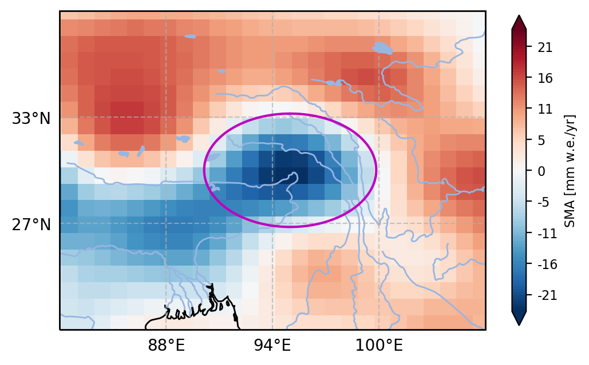
  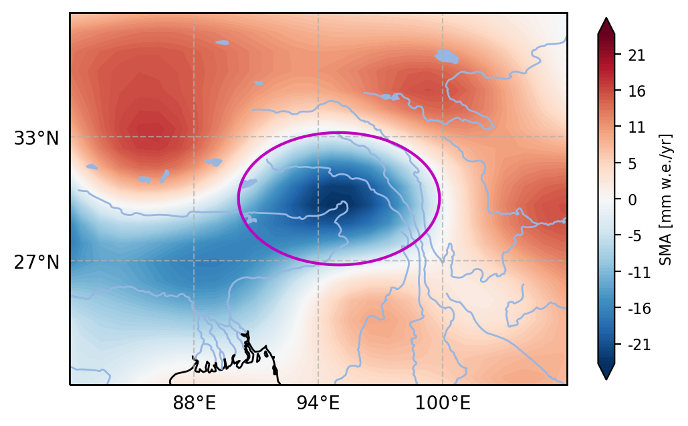
</p>

For more details, please refer to `gsm_r_ddk5_sma.rate?`, `gsm_r_ddk5_sma_rate.grid?`, `gsm_r_ddk5_sma_rate_grid?`, and `gsm_r_ddk5_sma_rate_grid.plot?`.

#### Method 2: convert SHCs to grids then estimate the rate of grids


```python
gsm_r_ddk5_sma_grid = gsm_r_ddk5_sma.grid(region)
gsm_r_ddk5_sma_grid_rate = gsm_r_ddk5_sma_grid.rate()

fig_name1 = 'sma_grid_rate_block.png'
fig_name2 = 'sma_grid_rate.png'
ylabel = 'SMA [mm w.e./yr]'
gsm_r_ddk5_sma_grid_rate.plot(fig_name1,ylabel,'block',study_area)
gsm_r_ddk5_sma_grid_rate.plot(fig_name2,ylabel,polygons=study_area)
```

    The calculation will take a few minutes, please be patient.
   
<p align="middle">
  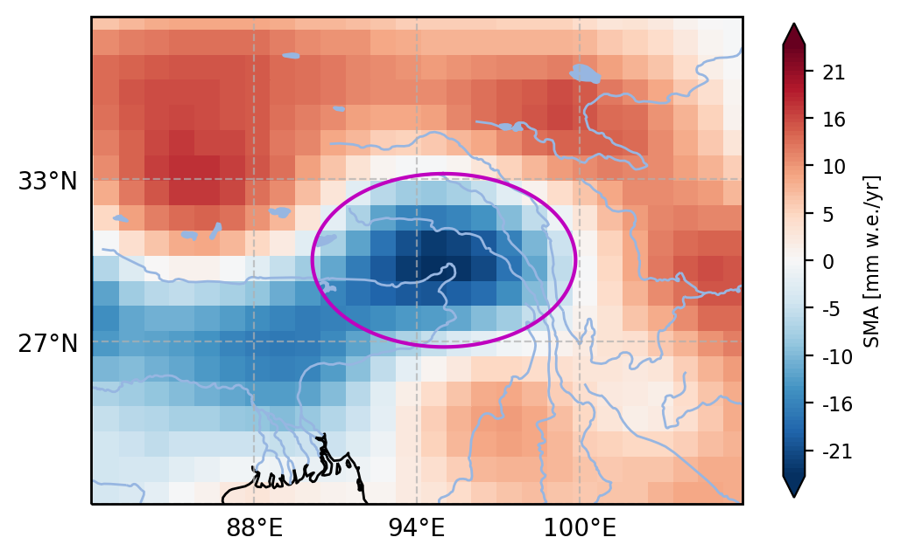
  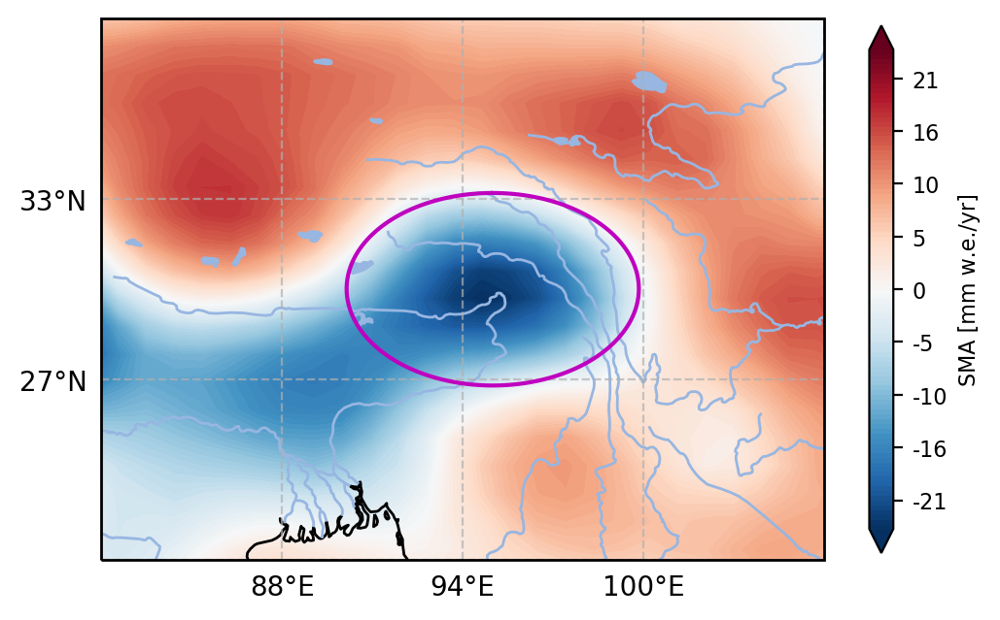
</p>    

Since the second method takes a lot of time to estimate the uncertainty of the grid data, the first method is recommended.

###  Calculate the time series of SMA over the study area and estimate its rate

#### Method 1: from SHCs to series and rate

Calculate the time series of SMA over the study area.


```python
gsm_r_ddk5_sma_series = gsm_r_ddk5_sma.study_area(study_area)
print(gsm_r_ddk5_sma_series,'\n')

# time series of SMA
print(gsm_r_ddk5_sma_series.qs,'\n')

# standard deviation
print(gsm_r_ddk5_sma_series.qs_std)
```

    title = Integral(over the study area) of Stokes coefficients for Surface Mass Anomaly(SMA) in Equivalent Water Thickness(EWT) derived from the DDK5 filtered Combined Deaveraged GRACE & GRACE-FO Geopotential Coefficients RL06 with C20 replaced by the SLR measurements
    time_coverage_start = 2002-04
    time_coverage_end = 2019-10
    solution_counts = 178
    total_month_counts = 211
    missing_month_counts = 33
    equi_material = Water
    
    [  7.80083803  58.62587324  73.76908473  37.28658384  53.38751612
      30.71881195   5.74150633  32.72088735  -1.42416991  18.75145636
      ...
     -47.60496348 -73.31059842 -73.00481244 -92.60124409 -78.85514767
     -53.20232491 -39.92594104 -51.5172863  -42.71680212  -8.95193687
     -22.16207019 -24.10597124 -40.20608753]
     
    [ 6.30457663  5.46950829  3.75575696  7.60148364  3.6918224   3.67420728
      4.16828886  5.49457631  3.99793319  3.27580461  2.89207024  3.71135591
      ...
      1.82726744  2.03576616  1.80579235  1.81882144  1.75091745  1.79941898
      1.75461899  1.83153935  1.98898853  1.77737887]


For more details, please refer to `gsm_r_ddk5_sma.study_area?` and `gsm_r_ddk5_sma_series?`.

Estimate the rate of the times series of SMA using ILSQM(Iterative Least Square Method). 


```python
gsm_r_ddk5_sma_series_rate = gsm_r_ddk5_sma_series.rate()
print('rate: ',gsm_r_ddk5_sma_series_rate.qs,' ± ',gsm_r_ddk5_sma_series_rate.qs_std)
print('area: ',gsm_r_ddk5_sma_series_rate.area,' km2')
```

    rate:  [-6.70810897]  ±  [0.48489388]
    area:  508282.0114287184  km2


For more details, please refer to `gsm_r_ddk5_sma_series.rate?`.

Plot the time series of SMA.


```python
fig_name = 'sma_series.png'
ylabel = 'SMA [Gt]'
gsm_r_ddk5_sma_series.plot(fig_name,ylabel)
```
<p align="middle">
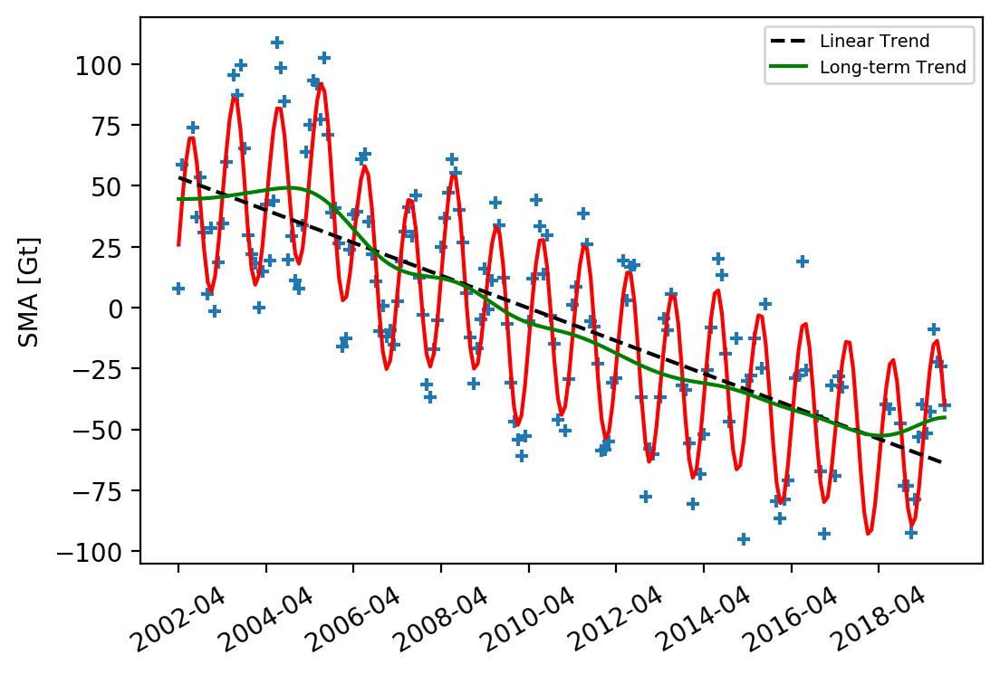
</p>

For more details, please refer to `gsm_r_ddk5_sma_series.plot?`.

Estimate the rate of the times series of SMA using IWLSQM(Iterative Weighted Least Square Method). 


```python
gsm_r_ddk5_sma_series_rate = gsm_r_ddk5_sma_series.rate('IWLSQM')
print('rate: ',gsm_r_ddk5_sma_series_rate.qs,' ± ',gsm_r_ddk5_sma_series_rate.qs_std)
print('area: ',gsm_r_ddk5_sma_series_rate.area,' km2')
```

    rate:  [-6.59799566]  ±  [0.03844455]
    area:  508282.0114287184  km2


Note that the rate of the time series through IWLSQM is close to that through IWLSQM, but the uncertainty of the rate differs by an order of magnitude.

Estimate the rate of SMA and its uncertainty using LSQM and WLSQM. Note that these two methods will not remove any outliers caused by abnormal monthly solutions.


```python
gsm_r_ddk5_sma_series_rate = gsm_r_ddk5_sma_series.rate('LSQM')
print('rate: ',gsm_r_ddk5_sma_series_rate.qs,' ± ',gsm_r_ddk5_sma_series_rate.qs_std)
print('area: ',gsm_r_ddk5_sma_series_rate.area,' km2','\n')

gsm_r_ddk5_sma_series_rate = gsm_r_ddk5_sma_series.rate('WLSQM')
print('rate: ',gsm_r_ddk5_sma_series_rate.qs,' ± ',gsm_r_ddk5_sma_series_rate.qs_std)
print('area: ',gsm_r_ddk5_sma_series_rate.area,' km2')
```

    rate:  [-6.59361023]  ±  [0.49616184]
    area:  508282.0114287184  km2 
    
    rate:  [-6.59776226]  ±  [0.03844441]
    area:  508282.0114287184  km2


#### Method 2: from SHCs rate to series rate


```python
gsm_r_ddk5_sma_rate_region = gsm_r_ddk5_sma_rate.study_area(study_area)
print(gsm_r_ddk5_sma_rate_region)
print('rate: ',gsm_r_ddk5_sma_rate_region.qs,' ± ',gsm_r_ddk5_sma_rate_region.qs_std)
print('area: ',gsm_r_ddk5_sma_rate_region.area,' km2')
```

    title = Integral(over the study area) of Annual change rate of Stokes coefficients for Surface Mass Anomaly(SMA) in Equivalent Water Thickness(EWT) derived from the DDK5 filtered Combined Deaveraged GRACE & GRACE-FO Geopotential Coefficients RL06 with C20 replaced by the SLR measurements
    time_coverage_start = 2002-04
    time_coverage_end = 2019-10
    solution_counts = 178
    total_month_counts = 211
    missing_month_counts = 33
    equi_material = Water
    rate:  [-6.86790848]  ±  [0.33702872]
    area:  508282.0114287184  km2


#### Method 3: from grids to series and rate


```python
gsm_r_ddk5_sma_grid_series = gsm_r_ddk5_sma_grid.study_area(study_area)
gsm_r_ddk5_sma_grid_series_rate = gsm_r_ddk5_sma_grid_series.rate()

print('rate: ',gsm_r_ddk5_sma_grid_series_rate.qs,' ± ',gsm_r_ddk5_sma_grid_series_rate.qs_std)
print('area: ',gsm_r_ddk5_sma_grid_series_rate.area,' km2')
```

    rate:  [-6.70774072]  ±  [0.48485163]
    area:  508317.01700056973  km2


#### Method 4.1: from grids rate to series rate

The grids rate is obtained by estimating the rate of the grid.


```python
gsm_r_ddk5_sma_grid_rate_region = gsm_r_ddk5_sma_grid_rate.study_area(study_area)
print(gsm_r_ddk5_sma_grid_rate_region)
print('rate: ',gsm_r_ddk5_sma_grid_rate_region.qs,' ± ',gsm_r_ddk5_sma_grid_rate_region.qs_std)
print('area: ',gsm_r_ddk5_sma_grid_rate_region.area,' km2')
```

    title = Annual change rate of Sum(over the study area) of grids expanded from Stokes coefficients for Surface Mass Anomaly(SMA) in Equivalent Water Thickness(EWT) derived from the DDK5 filtered Combined Deaveraged GRACE & GRACE-FO Geopotential Coefficients  RL06 with C20 replaced by the SLR measurements
    time_coverage_start = 2002-04
    time_coverage_end = 2019-10
    solution_counts = 178
    total_month_counts = 211
    missing_month_counts = 33
    equi_material = Water
    rate:  [-6.74723381]  ±  [0.08916294]
    area:  508317.01700056973  km2


#### Method 4.2: from grids rate to series rate

The grids rate is obtained by converting the SHCs rate.


```python
gsm_r_ddk5_sma_rate_grid_region = gsm_r_ddk5_sma_rate_grid.study_area(study_area)
print(gsm_r_ddk5_sma_rate_grid_region)
print('rate: ',gsm_r_ddk5_sma_rate_grid_region.qs,' ± ',gsm_r_ddk5_sma_rate_grid_region.qs_std)
print('area: ',gsm_r_ddk5_sma_rate_grid_region.area,' km2')
```

    title = Sum(over the study area) of grids expanded from Annual change rate of Stokes coefficients for Surface Mass Anomaly(SMA) in Equivalent Water Thickness(EWT) derived from the DDK5 filtered Combined Deaveraged GRACE & GRACE-FO Geopotential Coefficients  RL06 with C20 replaced by the SLR measurements
    time_coverage_start = 2002-04
    time_coverage_end = 2019-10
    solution_counts = 178
    total_month_counts = 211
    missing_month_counts = 33
    equi_material = Water
    rate:  [-6.8675455]  ±  [0.05935396]
    area:  508317.01700056973  km2


In theory, the four methods mentioned above are equivalent. Although the rates of the time series estimated by these methods are approximately equal, the standard deviations obtained by the first three methods are several times larger than those of the latter method. The first and the third method avoid the rate of SHCs or the rate of grids data, that is, the rate of the time series is obtained by an LSQ fitting directly.  Therefore, these two methods are recommended. Compared with the third method, the first method is less computationally expensive, so the first method takes less running time and is recommended.

## GLDAS

### Download GLDAS data

The GLDAS(Global Land Data Assimilation System) grid data is downloaded from [GES DISC](https://disc.gsfc.nasa.gov)(Goddard Earth Sciences Data and Information Services Center) by default. Before downloading the data, make sure you have an EARTHDATA account. If not, please go to the official [EARTHDATA](https://urs.earthdata.nasa.gov/home) website to register one.

Enter your username and password for EARTHDATA.


```python
username,password = 'your_username','your_password'
```

Download GLDAS monthly grid data with a spatial resolution of 1 degree from 2002-04 to 2019-10. 


```python
from ggtools.gg import gldas_download
start_date,end_date = '2002-04','2019-10'
gldas_download(username,password,start_date,end_date)
```

For more details, please refer to `gldas_download?`.

### Read GLDAS data

Read the GLDAS data from 2002-04 to 2019-10. Note that the number of the GLDAS monthly grids should be consistent with the number of the GRACE GSM monthly solutions, if you want to compare the two types of data.


```python
from ggtools.gg import read_gldas
gldas = read_gldas('2002-04','2019-10')
print(gldas,'\n')
print(gldas.lats,'\n')
print(gldas.lons)
```

    title = GLDAS2.1 LIS land surface model output monthly mean
    resolution = 1deg
    institution = NASA GSFC
    time_coverage_start = 2002-04
    time_coverage_end = 2019-10
    solution_counts = 211
    total_month_counts = 211
    missing_month_counts = 0
    
    <xarray.DataArray 'lat' (lat: 150)>
    array([-59.5, -58.5, -57.5, ...,  87.5,  88.5,  89.5], dtype=float32)
    Coordinates:
      * lat      (lat) float32 -59.5 -58.5 -57.5 -56.5 -55.5 ... 86.5 87.5 88.5 89.5
    Attributes:
        units:          degrees_north
        standard_name:  latitude
        long_name:      latitude
        vmin:           -59.5
        vmax:           89.5 
    
    <xarray.DataArray 'lon' (lon: 360)>
    array([-179.5, -178.5, -177.5, ...,  177.5,  178.5,  179.5], dtype=float32)
    Coordinates:
      * lon      (lon) float32 -179.5 -178.5 -177.5 -176.5 ... 177.5 178.5 179.5
    Attributes:
        units:          degrees_east
        standard_name:  longitude
        long_name:      longitude
        vmin:           -179.5
        vmax:           179.5


For more details, please refer to `read_gldas?` and `gldas?`.

### Calculate Terrestrial Water Storage Change

Two ways to estimate TWSC are provided. The first one is the classic(traditional) technique, i.e. $TWSC = SoilMoi + AccumSnow + Canopy$. The second is through the water balance equation, i.e. $TWSC = Precipitation - WaterEvaporation - SurfaceRunoff - SubsurfaceRunoff$. The difference in results obtained by these two methods is minimal. Note: The TWSC has been de-averaged. The unit of TWSC is [kg/m2] or [mm w.e.].


```python
twsc_grid = gldas.twsc_grid(region)
print(twsc_grid)
print(twsc_grid.summary)
```

    title = Terrestrial Water Storage Change(TWSC) derived from the GLDAS2.1 LIS land surface model output monthly mean
    time_coverage_start = 2002-04
    time_coverage_end = 2019-10
    solution_counts = 211
    total_month_counts = 211
    missing_month_counts = 0
    equi_material = Water
    region = [82, 106, 21, 39]
    TWSC is estimated by the formulation: [TWSC = SoilMoi(0-200cm) + Accum_Snow + Canopy], and it has been converted to Equivalent Water Thickness in mm w.e.


For more details, please refer to `gldas.twsc_grid?`.

### Estimate the rate of TWSC


```python
twsc_grid_rate = twsc_grid.rate()
print(twsc_grid_rate)
```

    title = Annual change rate of Terrestrial Water Storage Change(TWSC) derived from the GLDAS2.1 LIS land surface model output monthly mean
    time_coverage_start = 2002-04
    time_coverage_end = 2019-10
    solution_counts = 211
    total_month_counts = 211
    missing_month_counts = 0
    equi_material = Water
    region = [82, 106, 21, 39]


### Plot the rate of TWSC


```python
fig_name1 = 'twsc_grid_rate_block.png'
fig_name2 = 'twsc_grid_rate.png'
ylabel = 'TWSC [mm w.e./yr]'
twsc_grid_rate.plot(fig_name1,ylabel,'block',study_area)
twsc_grid_rate.plot(fig_name2,ylabel,polygons=study_area)
```

<p align="middle">
  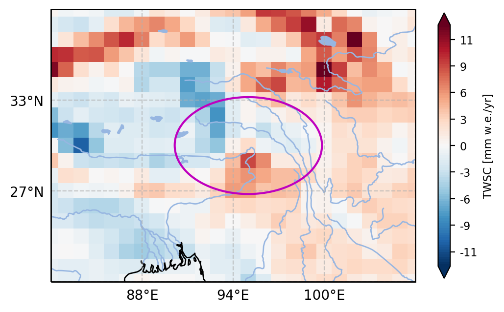
  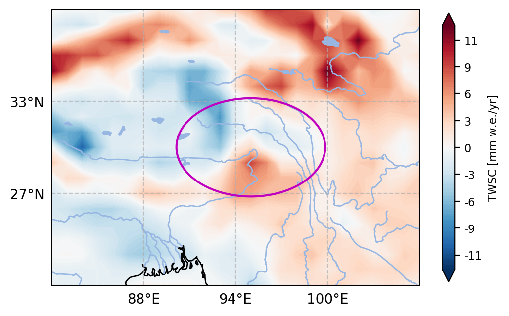
</p>


### Calculate the time series of TWSC and estimate its rate

Calculate the time series of TWSC.


```python
twsc_grid_series = twsc_grid.study_area(study_area)
```

Estimate the rate of the times series.


```python
twsc_grid_series_rate = twsc_grid_series.rate()
print(twsc_grid_series_rate,'\n')
print('rate: ',twsc_grid_series_rate.qs,' ± ',twsc_grid_series_rate.qs_std)
print('area: ',twsc_grid_series_rate.area,' km2')
```

    title = Annual change rate of Terrestrial Water Storage Change(TWSC) derived from the GLDAS2.1 LIS land surface model output monthly mean
    time_coverage_start = 2002-04
    time_coverage_end = 2019-10
    solution_counts = 211
    total_month_counts = 211
    missing_month_counts = 0
    equi_material = Water 
    
    rate:  [0.33623102]  ±  [0.36229108]
    area:  504185.85874313745  km2


### Plot the time series of TWSC


```python
fig_name = 'twsc_series.png'
ylabel = 'TWSC [Gt]'
twsc_grid_series.plot(fig_name,ylabel)
```
<p align="middle">
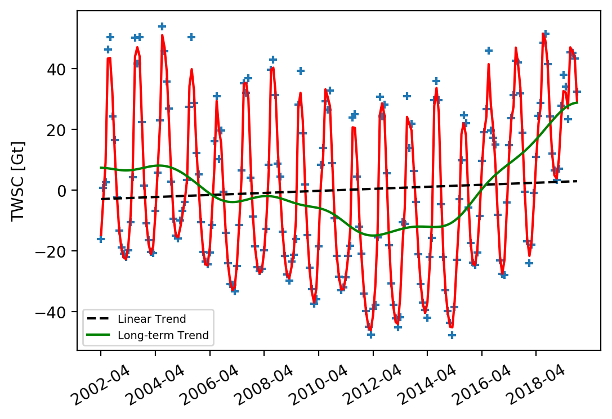
</p>

## Signal leakage correction

### Method 1: scale factor

The scale factor(or gain factor) is sensitive to the linear trend of the time series and not to the annual term. Besides, it has local characteristics, i.e., different regions correspond different scale factors. This method is only applicable when the SMA distribution derived from GRACE in the study area is similar to the TWSC distribution derived from GLDAS.


```python
from ggtools.gg import scale_factor

twsc_coeffs = gldas.twsc_shc(96) # 96th-degree SHCs for TWSC
print(twsc_coeffs,'\n')

k = scale_factor(twsc_coeffs,study_area,160) 
print(k)
```

    title = Terrestrial Water Storage Change(TWSC) derived from the GLDAS2.1 LIS land surface model output monthly mean
    max_degree = 89
    max_order = 89
    degree_order = 96
    normalization = fully normalized
    institution = NASA GSFC
    processing_level = CF-1.6
    product_version = Noah_v3.3 forced with GDAS-AGRMET-GPCP
    time_coverage_start = 2002-04
    time_coverage_end = 2019-10
    solution_counts = 211
    total_month_counts = 211
    missing_month_counts = 0
    
    0.9867288021260247


For more details, please refer to `gldas.twsc_shc?` and `scale_factor?`.


```python
gsm_r_ddk5_sma_series_rate_leakage = gsm_r_ddk5_sma_series_rate.leakage_correction('scale_factor',k)
print(gsm_r_ddk5_sma_series_rate_leakage,'\n')
print('rate: ',gsm_r_ddk5_sma_series_rate_leakage.qs,' ± ',gsm_r_ddk5_sma_series_rate_leakage.qs_std)
print('area: ',gsm_r_ddk5_sma_series_rate_leakage.area,' km2')
```

    title = Signal leakage corrected(Scale factor method) Annual change rate of Integral(over the study area) of Stokes coefficients for Surface Mass Anomaly(SMA) in Equivalent Water Thickness(EWT) derived from the DDK5 filtered Combined Deaveraged GRACE & GRACE-FO Geopotential Coefficients RL06 with C20 replaced by the SLR measurements
    time_coverage_start = 2002-04
    time_coverage_end = 2019-10
    solution_counts = 178
    total_month_counts = 211
    missing_month_counts = 33
    equi_material = Water 
    
    rate:  [-6.61908433]  ±  [0.47845876]
    area:  508282.0114287184  km2


For more details, please refer to `gsm_r_ddk5_sma_series_rate.leakage_correction?`.

### Method 2 : forward modeling


```python
# calculate the global grid for SMA
gsm_r_ddk5_sma_grid = gsm_r_ddk5_sma.grid()
gsm_r_ddk5_sma_grid_leakage = gsm_r_ddk5_sma_grid.leakage_correction('forward_model',160)
gsm_r_ddk5_sma_grid_leakage_series = gsm_r_ddk5_sma_grid_leakage.study_area(study_area)
gsm_r_ddk5_sma_grid_leakage_series_rate = gsm_r_ddk5_sma_grid_leakage_series.rate()

print('rate: ',gsm_r_ddk5_sma_grid_leakage_series_rate.qs,' ± ',gsm_r_ddk5_sma_grid_leakage_series_rate.qs_std)
print('area: ',gsm_r_ddk5_sma_grid_leakage_series_rate.area,' km2')
```

    rate:  [-8.37598258]  ±  [0.50297716]
    area:  508317.01700056973  km2


For more details, please refer to `gsm_r_ddk5_sma_grid.leakage_correction?`.

### Method 3 : space domain

This method requires setting the locations of the mascons in advance. Take the glacier catalog with an area of not less than 10 $km^2$ in Southeast Tibet as an example.


```python
import numpy as np
from ggtools.gg import generate_nodes

glaciers = np.loadtxt('glaciers.txt')
print(glaciers)
```

    [[30.650817 99.443696]
     [29.91388  99.635285]
     [28.492921 98.660107]
     ...
     [28.985472 97.526066]
     [30.292734 90.38734 ]
     [30.415653 90.54994 ]]

Generate the mascon nodes(centers) based on the glacier catalog.

```python
nodes = generate_nodes(gsm_r_ddk5_sma_rate_grid,glaciers,study_area)
gsm_r_ddk5_sma_rate_grid_leakage = gsm_r_ddk5_sma_rate_grid.leakage_correction('space_domain',160,nodes,study_area)
gsm_r_ddk5_sma_rate_grid_leakage_series = gsm_r_ddk5_sma_rate_grid_leakage.study_area(study_area)

print('rate: ',gsm_r_ddk5_sma_rate_grid_leakage_series.qs,' ± ',gsm_r_ddk5_sma_rate_grid_leakage_series.qs_std)
print('area: ',gsm_r_ddk5_sma_rate_grid_leakage_series.area,' km2')
```

    rate:  [-8.55902161]  ±  [0.]
    area:  508317.01700056973  km2

Because it involves the uncertainties of estimated parameters in Tikhonov regularization, the standard deviation for the rate is temporarily set to 0. This will be improved in the next version of ggtools.

Plot the rate of mascons.

```python
fig_name1 = 'SMA_SpaceD_block.png'
fig_name2 = 'SMA_SpaceD.png'
ylabel = 'SMA [mm w.e./yr]'

gsm_r_ddk5_sma_rate_grid_leakage.plot(fig_name1,ylabel,'block',study_area,nodes.nodes)
gsm_r_ddk5_sma_rate_grid_leakage.plot(fig_name2,ylabel,polygons=study_area,circles=nodes.nodes)
```

<p align="middle">
  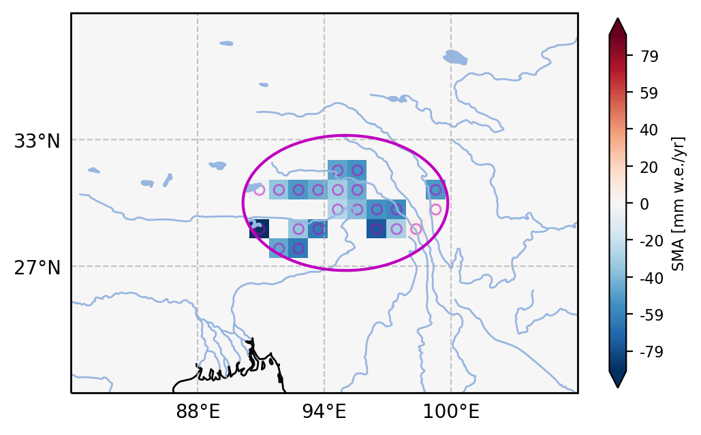
  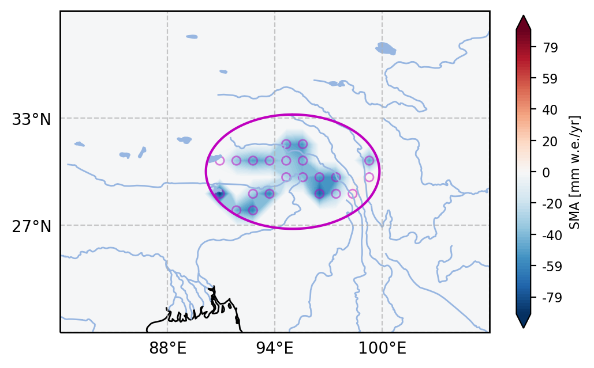
</p>

### Method 4 : inverse filtering

This method is equivalent to the forward modeling. The algorithm is extremely simple and avoids the iterative process in the forward modeling.


```python
gsm_r_ddk5_sma_leakage = gsm_r_ddk5_sma.leakage_correction('filter_inverse',160)
gsm_r_ddk5_sma_leakage_series = gsm_r_ddk5_sma_leakage.study_area(study_area)
gsm_r_ddk5_sma_leakage_series_rate = gsm_r_ddk5_sma_leakage_series.rate()

print('rate: ',gsm_r_ddk5_sma_leakage_series_rate.qs,' ± ',gsm_r_ddk5_sma_leakage_series_rate.qs_std)
print('area: ',gsm_r_ddk5_sma_leakage_series_rate.area,' km2')
```

    rate:  [-8.37974852]  ±  [0.50322993]
    area:  508282.0114287184  km2

### Method 5 : spectral domain

This method requires setting the locations of the mascons in advance. Still take the glacier catalog with an area of not less than 10 $km^2$ in Southeast Tibet as an example.


```python
# global grids
gsm_r_ddk5_sma_rate_grid = gsm_r_ddk5_sma_rate.grid()
nodes = generate_nodes(gsm_r_ddk5_sma_rate_grid,glaciers,study_area)

gsm_r_ddk5_sma_rate_leakage_grid = gsm_r_ddk5_sma_rate.leakage_correction('spectral_domain',160,nodes,study_area,'windows',area_ratio)
gsm_r_ddk5_sma_rate_leakage_grid_series = gsm_r_ddk5_sma_rate_leakage_grid.study_area(study_area)

print('rate: ',gsm_r_ddk5_sma_rate_leakage_grid_series.qs,' ± ',gsm_r_ddk5_sma_rate_leakage_grid_series.qs_std)
print('area: ',gsm_r_ddk5_sma_rate_leakage_grid_series.area,' km2')
```

    rate:  [-7.33355992]  ±  [0.]
    area:  508317.01700056973  km2

Because it involves the uncertainties of estimated parameters in Tikhonov regularization, the standard deviation for the rate is temporarily set to 0. This will be improved in the next version of ggtools. Note that the 2x area ratio multiplication is just to use more tapers in windowed spherical harmonics.

```python
gsm_r_ddk5_sma_rate_leakage_grid_crop = gsm_r_ddk5_sma_rate_leakage_grid.set_region(region)

fig_name1 = 'SMA_SpectralD_block.png'
fig_name2 = 'SMA_SpectralD.png'
ylabel = 'SMA [mm w.e./yr]'

gsm_r_ddk5_sma_rate_leakage_grid_crop.plot(fig_name1,ylabel,'block',study_area,nodes.nodes)
gsm_r_ddk5_sma_rate_leakage_grid_crop.plot(fig_name2,ylabel,polygons=study_area,circles=nodes.nodes)
```

<p align="middle">
  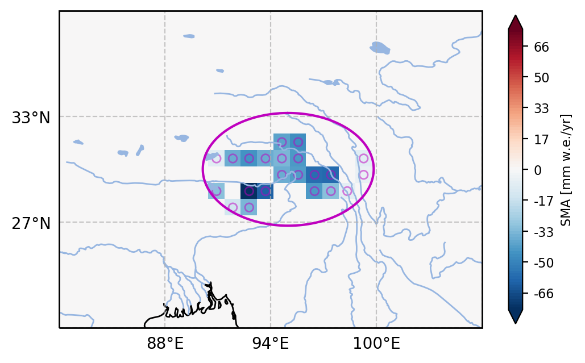
  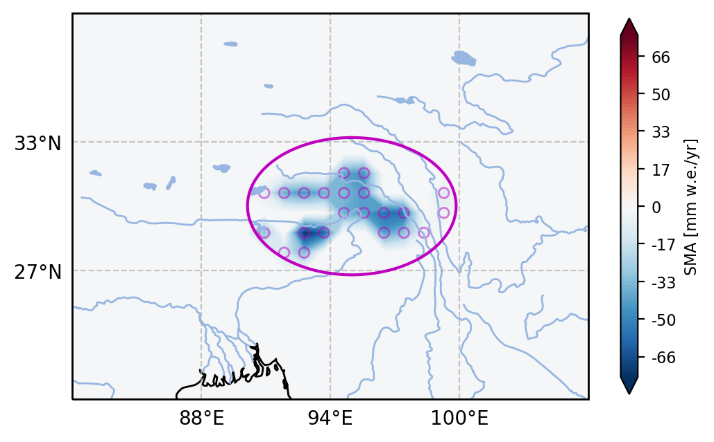
</p>

### Method 6 : deconvolution

In Forward Modeling, the purpose of the signal leakage correction is to find a solution for the equation $\mathcal F(X) = Y$, where $X$ is the true mass distribution to be determined, $Y$ is the apparent mass distribution, and $\mathcal F$ represents the combination of spherical harmonic truncations and filter smoothing. One way to solve this equation is by iteration, which happens to be what the Forward Modeling does. Another possible approach is to find the expression of $\mathcal F$. Fortunately, $\mathcal F(X)$ can be expressed as a convolution, i.e., $\mathcal F(X)\equiv X\otimes PSF$, where PSF is a convolution kernel, i.e., the point spread function. According to $X = \mathcal F^{-1}(Y)$, we can deduce $X = Y \otimes/\otimes PSF$, where $\otimes/\otimes$ denotes the deconvolution operator. The unsupervised Wiener-Hunt algorithm can be employed to implement the deconvolution, and it has been one of the modules among the scikit-image package. 

## 'Equivalent' Gaussian filter radius for DDK filtering

Place a unit mass with an equivalent water thickness of 1000mm at the North Pole and expand it to a specific degree, and perform DDK filtering and Gaussian filtering, respectively. Change the Gaussian filtering radius to maximize the correlation coefficient of the filtered spectrum. At this time, the Gaussian filtering radius is the 'equivalent' radius corresponding to the DDK filtering. Note: This method is suitable for DDK4 ~ DDK8 filtering. For 'equivalent radius' of DDK1 ~ DDK3, please refer to [Kusche 2009](https://link.springer.com/article/10.1007/s00190-009-0308-3).

```
from ggtools.gg import ddk_gaussian

for i in range(1,9):
    ddk_gaussian('DDK'+str(i),96)
    
ddk_gaussian('DDK5',96,'visible') 
```

``` 
Correlation: 0.9776
Approximate equivalent Gaussian filter radius for DDK1: 345
Correlation: 0.9671
Approximate equivalent Gaussian filter radius for DDK2: 255
Correlation: 0.9593
Approximate equivalent Gaussian filter radius for DDK3: 200
Correlation: 0.9578
Approximate equivalent Gaussian filter radius for DDK4: 190
Correlation: 0.9570
Approximate equivalent Gaussian filter radius for DDK5: 160
Correlation: 0.9583
Approximate equivalent Gaussian filter radius for DDK6: 150
Correlation: 0.9660
Approximate equivalent Gaussian filter radius for DDK7: 125
Correlation: 0.9714
Approximate equivalent Gaussian filter radius for DDK8: 110
Correlation: 0.9570
Approximate equivalent Gaussian filter radius for DDK5: 160
```

<p class="half">
  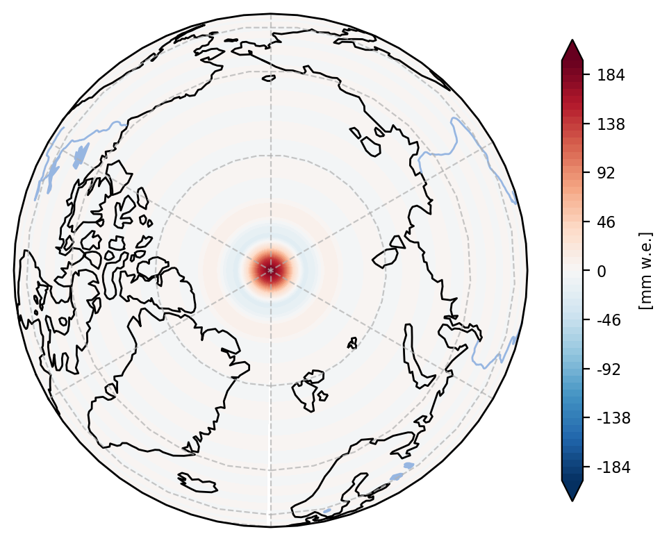
  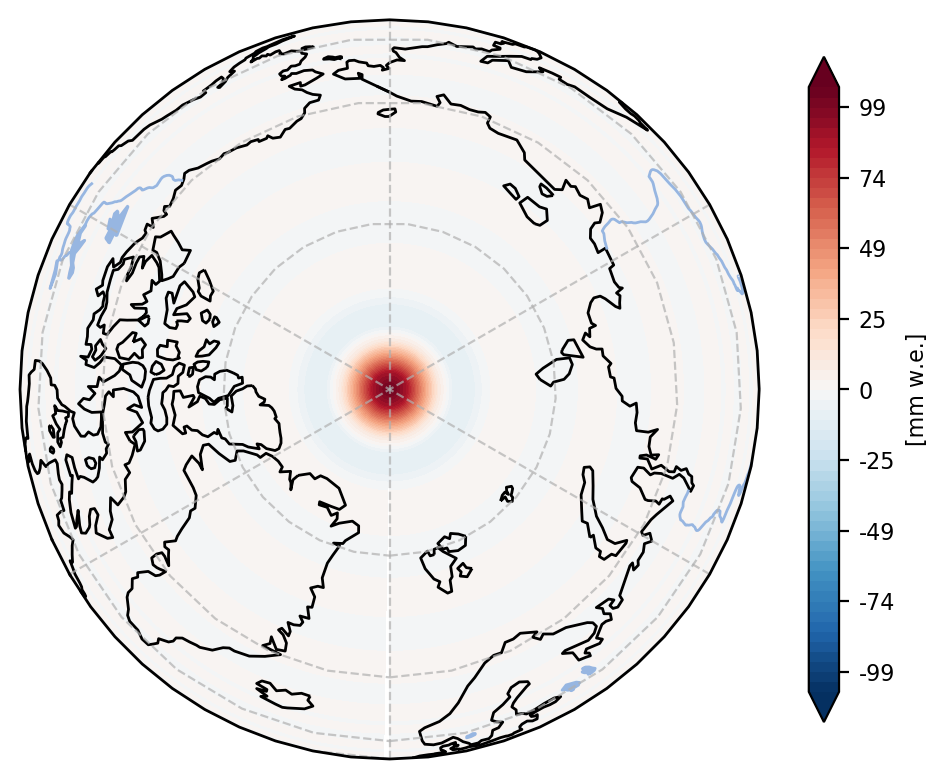
  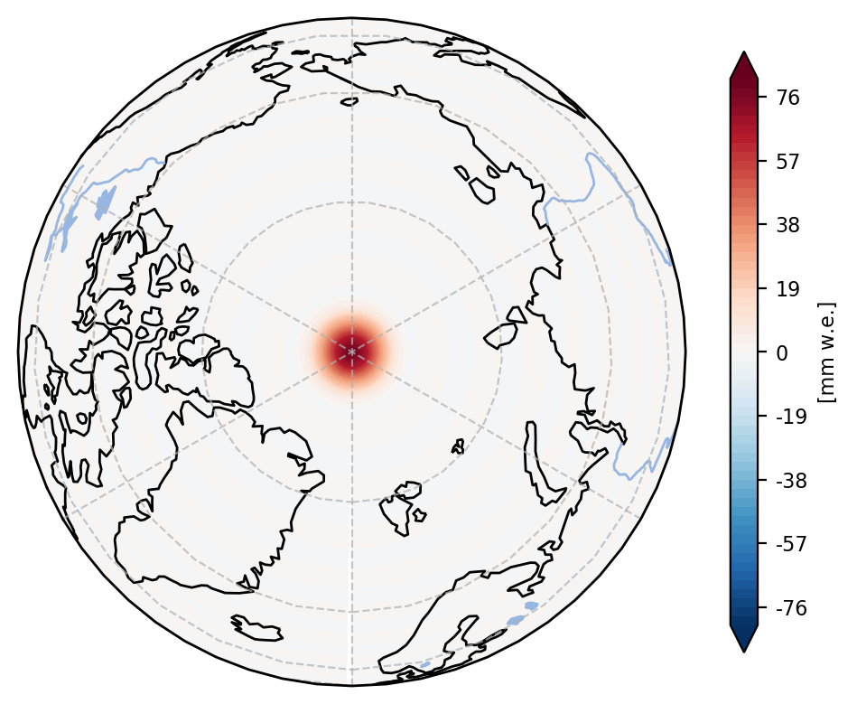
</p>

(a) Unit mass after expanding and truncating up to 96th degree. (b) after DDK5 filtering (c) after Gaussian filtering with a radius of 160km

<p align="middle">
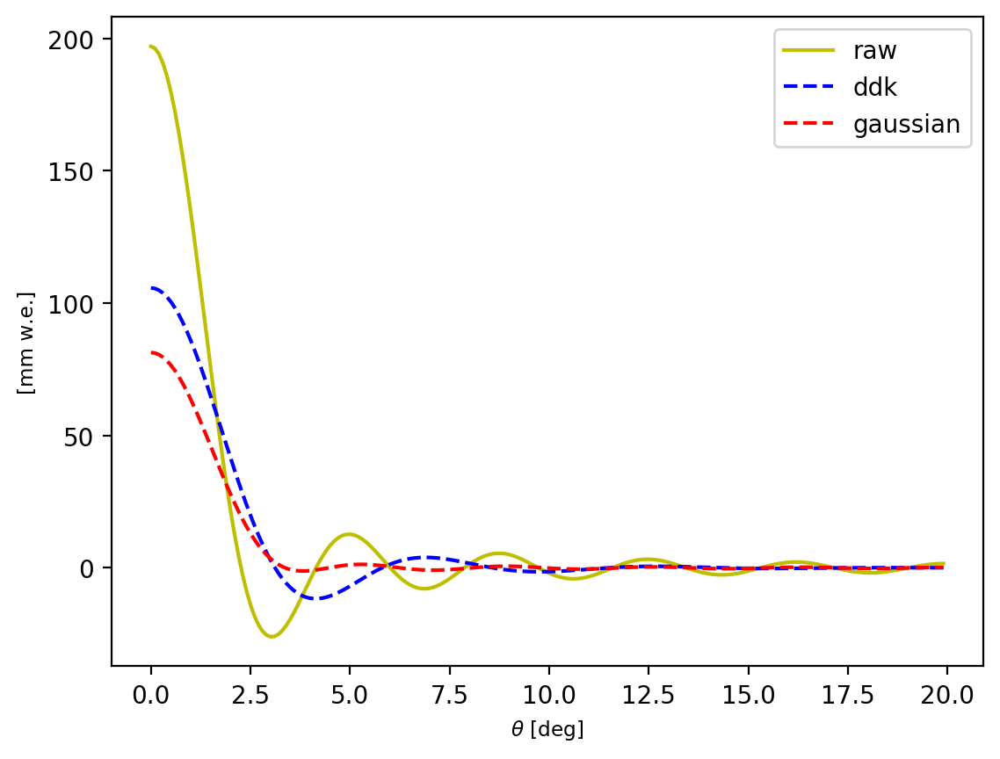
</p>    

<center>Cross section for the unit mass</center>
For more details, please refer to `ddk_gaussian?`.

## GRACE minus TWSC

```
# for signal leakage correction with inverse filtering
gsm_twsc_series = gsm_r_ddk5_sma_leakage_series - twsc_grid_series
gsm_twsc_series_rate = gsm_twsc_series.rate()

fig_name = 'GRACE_TWSC_series.png'
ylabel = 'GRACE-TWSC [Gt]'
gsm_twsc_series.plot(fig_name,ylabel,kernel='rbf')
```
<p align="middle">
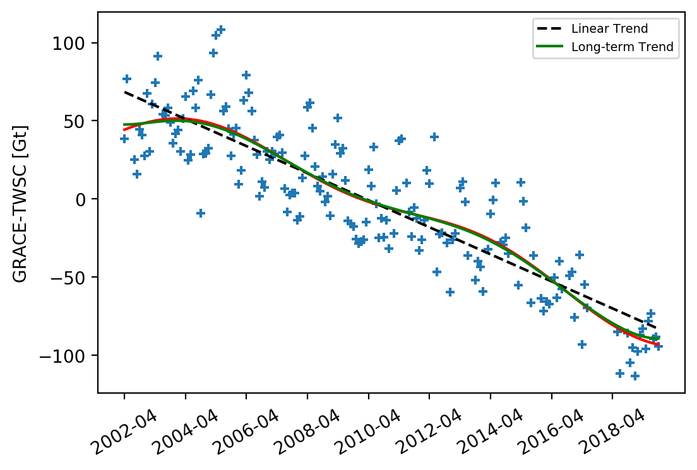
</p>

## Next release

 - Complete the help documentation

 - Improve the code structure to make it easier to read

 - Add outliers elimination in Gaussian Process Regression(GPR)

 - Add a module to handle Glacial Isostatic Adjustment(GIA) effects

 - Add other destriping filters, such as P4M6

 - Add other map projections, such as AlbersEqualArea

 - Fix the issue that the boundary file goes across the prime meridian

 - Find a way to quickly calculate the uncertainty of the grid data

 - Estimate the uncertainty of parameters in Tikhonov regularization

   

## Acknowledgments

Thank the ISDC for sharing the GRACE & GRACE-FO data, GES DISC for the GLDAS land surface model data, and the Cold and Arid Regions Environmental and Engineering Research Institute(CAREERI) for providing the Second Glacier Inventory Dataset of China(SGIDC). Many appreciations to the contributors of [SHTOOLS ](https://shtools.oca.eu/shtools/public/)and [GRACE-filter](https://github.com/strawpants/GRACE-filter).
